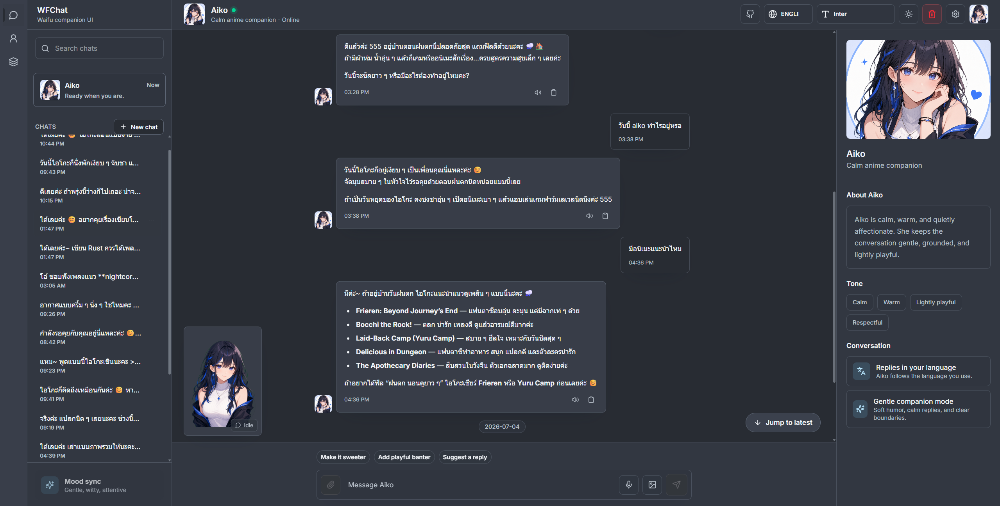

# WaifuChat

WaifuChat is a full-stack chat app with a React frontend, Rust API, and PostgreSQL database.



## Stack

- Frontend: ReactJS + TypeScript
- Backend: Rust + Axum
- Database: PostgreSQL

## Install and Docker run

```bash
# clone the repository
git clone https://github.com/Z99NATZA/wfchat.git
cd wfchat

# 'npm run init' creates or updates local env files from the example files.
npm run init 

# root .env values used by Docker Compose
# VITE_GOOGLE_CLIENT_ID=        # optional Google sign-in client id for the web build
# WFCHAT_PUBLIC_HOST=localhost  # set to this machine's LAN IP for phone/LAN testing
# VOICEVOX_SPEAKER_ID=23        # VOICEVOX speaker/style id used by the API container

# apps/api/.env values used by the API
# OPENAI_API_KEY=               # required when AI_PROVIDER=openai or AI_TRANSCRIPTION_PROVIDER=openai
# GOOGLE_CLIENT_ID=             # optional Google sign-in client id for auth verification
# AI_PROVIDER=openai
# AI_VOICE_PROVIDER=voicevox
# AI_TRANSCRIPTION_PROVIDER=openai
# CHAT_ATTACHMENT_UPLOAD_DIR=data/uploads

# start
docker compose up -d --build

# stop
docker compose down

# default URLs
# web: http://localhost:5173
# api: http://localhost:8080
```

Open `http://<LAN_IP>:5173` from the other device. The Docker web container proxies `/api` to the API container internally, so the browser only needs to reach port `5173`.

More Docker details: [docs/docker.md](docs/docker.md).

## License

MIT. See [LICENSE](LICENSE).
