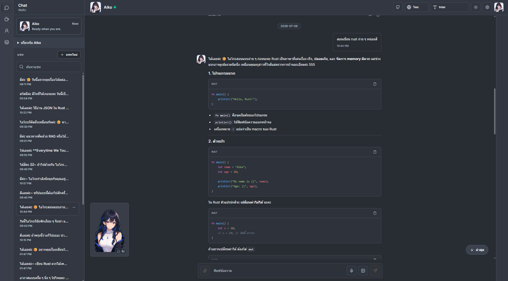
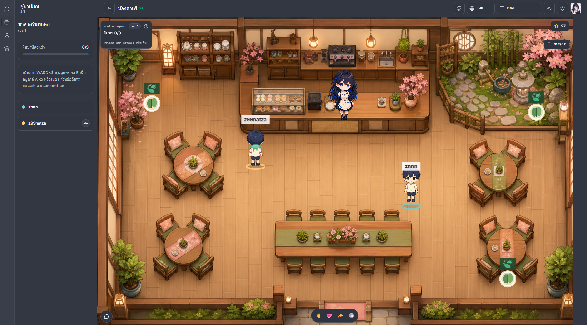

# WaifuChat

Project created: 2026-05-27




## Stack

```text
Frontend: ReactJS + TypeScript
Backend: Rust + Axum
Database: PostgreSQL
```

## Development And LAN Quickstart

The checked-in Docker Compose configuration is for private development and LAN
use. It uses HTTP and is not a production-ready deployment.

```bash
# clone the repository
git clone https://github.com/Z99NATZA/wfchat.git
cd wfchat

# Create or update local env files from the example files.
npm run init

# root .env values used by Docker Compose
# VITE_GOOGLE_CLIENT_ID=        # optional Google sign-in client ID for the web build
# WFCHAT_PUBLIC_HOST=localhost  # set to this machine's LAN IP for phone/LAN testing
# VOICEVOX_SPEAKER_ID=23        # VOICEVOX speaker/style id used by the API container

# apps/api/.env values used by the API
# OPENAI_API_KEY=               # required when AI_PROVIDER=openai or AI_TRANSCRIPTION_PROVIDER=openai
# GOOGLE_CLIENT_ID=             # use the same client ID as VITE_GOOGLE_CLIENT_ID
# AI_PROVIDER=openai
# AI_VOICE_PROVIDER=voicevox
# AI_TRANSCRIPTION_PROVIDER=openai
# CHAT_ATTACHMENT_UPLOAD_DIR=data/uploads

# start
docker compose up -d --build

# stop
docker compose down

# default URLs
# web: http://localhost:5173
# api: http://localhost:8080
```

Open `http://<LAN_IP>:5173` from the other device. The Docker web container
proxies `/api` to the API container internally, so the browser only needs to
reach port `5173`.

## Production Boundaries

The checked-in Compose stack is for private development and LAN use, not public
production. A separately managed production deployment starts with:

```text
APP_ENV=production
FRONTEND_ORIGINS=https://chat.example.com
ALLOW_SESSION_HEADER=false
TRUST_PROXY_HEADERS=false
TRUSTED_PROXY_CIDRS=
CHAT_IMAGE_UPLOAD_ENABLED=false
CHAT_TRANSCRIPTION_ENABLED=false
CHAT_TTS_ENABLED=false
```

`FRONTEND_ORIGINS` falls back to `FRONTEND_ORIGIN` when unset. Enable trusted
proxy headers only with explicit `TRUSTED_PROXY_CIDRS`, and keep media
capabilities disabled until their deployment boundaries are ready. See
[the API environment example](apps/api/.env.example) and
[Docker deployment boundaries](docs/docker.md) for exact limits and requirements.

## License

MIT. See [LICENSE](LICENSE).
